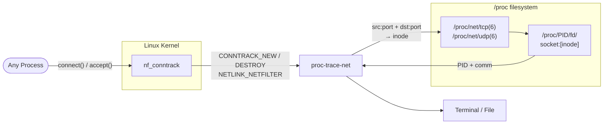
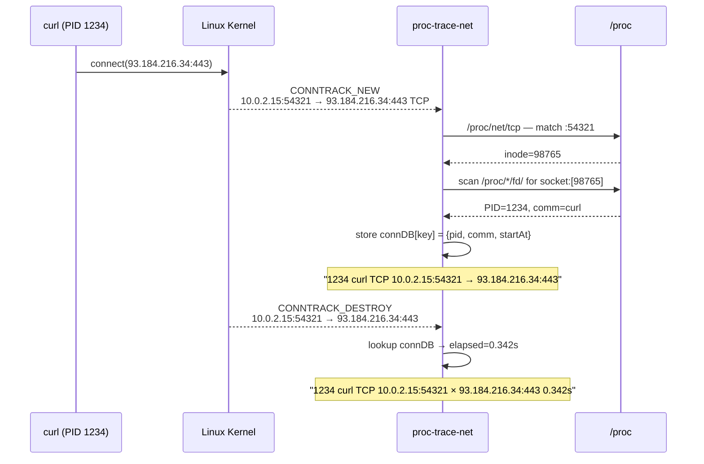

<div align="center">
  
  <h1>proc-trace-net</h1>
  <p><strong>See every network connection on your Linux system — in real time.</strong></p>

  
  
  
  
</div>

---

`proc-trace-net` hooks into the Linux kernel's **conntrack** subsystem via a netlink socket and prints a line every time any process opens or closes a TCP or UDP connection — with PID, process name, direction, and optional timing. No eBPF, no `ptrace`, no kernel module — just a netlink socket and `/proc`.

<div align="center">
  
</div>

---

## ✨ Features

- 🌐 **System-wide** — every TCP/UDP connection on the machine, not just your shell
- 🔍 **PID + name** — correlates each connection to the owning process via `/proc/net/tcp` inode lookup
- ↔️ **Direction** — `→` outbound, `←` inbound, `↔` unknown
- ⏱️ **Close timing** (`-t`) — elapsed duration printed when a connection closes
- 🔄 **TCP state updates** (`-U`) — shows ESTABLISHED, FIN_WAIT, TIME_WAIT transitions
- 🔎 **Reverse DNS** (`-r`) — async PTR lookup for remote IPs, cached per session
- 🌿 **Subtree filter** (`-p PID`) — watch only one process and its descendants
- 🚀 **CMD mode** — `proc-trace-net CMD...` runs a command and traces only its traffic
- 📦 **Single static binary**, zero runtime dependencies

---

## 📋 Requirements

| Requirement | Notes |
|-------------|-------|
| `CONFIG_NF_CONNTRACK=y` | Standard on any distro running Docker, iptables, or nftables |
| Root or `CAP_NET_ADMIN` | Required to bind the conntrack netlink socket |
| Linux kernel ≥ 3.6 | Conntrack multicast groups have been stable since 3.x |

---

## 🔨 Build

### Docker — no local Go install needed

```bash
chmod +x build.sh
./build.sh
# → dist/proc-trace-net-linux-amd64
# → dist/proc-trace-net-linux-arm64
```

### From source

```bash
go build -o proc-trace-net .
```

### Fully static binary

```bash
CGO_ENABLED=0 go build -ldflags="-s -w" -o proc-trace-net .
```

---

## 🚀 Usage

```
proc-trace-net [-ctUurQ46] [-o FILE] [-p PID[,PID,...] | CMD...]
```

### 🌍 Watch all connections system-wide

```bash
sudo proc-trace-net -ctu
```

<div align="center">
  
</div>

### 🎯 Trace a command and all of its connections

```bash
sudo proc-trace-net -ctr curl https://github.com
```

```
84231 curl         TCP  10.0.2.15:55104          →  140.82.121.3:443      [github.com]
```

### ⏱️ Show close events with elapsed time

```bash
sudo proc-trace-net -ct
```

```
84231 curl         TCP  10.0.2.15:55104          →  140.82.121.3:443
84231 curl         TCP  10.0.2.15:55104          ×  140.82.121.3:443      0.487s
```

### 🔄 Show TCP state transitions

```bash
sudo proc-trace-net -cU
```

```
84231 curl         TCP  10.0.2.15:55104          →  140.82.121.3:443
84231 curl         TCP  10.0.2.15:55104          ⇒  140.82.121.3:443      ESTABLISHED
84231 curl         TCP  10.0.2.15:55104          ⇒  140.82.121.3:443      FIN_WAIT
```

### 🔭 Watch an existing process and all its children

```bash
sudo proc-trace-net -p $(pgrep nginx | paste -sd,)
```

### 📝 Log everything to a file quietly

```bash
sudo proc-trace-net -Qo /var/log/connections.log &
```

---

## 🏳️ Flags

| Flag | Description |
|------|-------------|
| `-c` | Colorize output (auto-detected when stdout is a tty) |
| `-t` | Show connection close events with elapsed duration |
| `-U` | Show TCP state update events (`ESTABLISHED`, `FIN_WAIT`, …) |
| `-u` | Print owning user of each connection |
| `-r` | Reverse DNS lookup for remote IPs (async, cached per session) |
| `-4` | IPv4 connections only |
| `-6` | IPv6 connections only |
| `-o FILE` | Write output to `FILE` instead of stdout |
| `-p PID` | Only trace PID and its descendants (comma-separate for multiple) |
| `-Q` | Suppress error messages |

---

## 📐 Output format

```
  PID  COMM         PROTO  SRC_IP:PORT              DIR  DST_IP:PORT              [extra]
```

| Symbol | Meaning |
|--------|---------|
| `→` | Outbound — local process initiated the connection |
| `←` | Inbound — remote host connected to a local service |
| `↔` | Unknown direction — PID lookup lost the race |
| `⇒` | TCP state update (with `-U`) |
| `×` | Connection closed (with `-t`) |

The `[extra]` field shows a reverse DNS hostname (with `-r`), a TCP state name (with `-U`), or elapsed duration (with `-t`).

---

## ⚙️ How it works

Linux tracks every TCP and UDP connection through the **conntrack** subsystem (`nf_conntrack`). Conntrack publishes real-time events over a netlink socket (`AF_NETLINK` / `NETLINK_NETFILTER`, multicast groups `NF_NETLINK_CONNTRACK_NEW` and `NF_NETLINK_CONNTRACK_DESTROY`). Any process holding `CAP_NET_ADMIN` can subscribe and receive a message for every new or closed connection, system-wide — the same mechanism `conntrack -E` and `iptables` itself use.





**On each NEW event:**

1. Parse the `CTA_TUPLE_ORIG` nested netlink attributes to extract src/dst IP, port, and protocol
2. Read `/proc/net/tcp` (or `tcp6` / `udp` / `udp6`) to find the socket whose local and remote addresses match the tuple — this gives us a socket inode number
3. Scan `/proc/<pid>/fd/` symlinks across all PIDs for `socket:[inode]` to find the owning process
4. Read `/proc/<pid>/comm` for the process name
5. Store the entry (PID, comm, direction, start time) in an in-memory map keyed by the connection tuple
6. Print the formatted line

**On each DESTROY event:** look up the stored entry, compute elapsed time (with `-t`), print the close line, remove from map.

**On UPDATE events** (with `-U`): parse `CTA_PROTOINFO_TCP_STATE` to get the new conntrack TCP state (`SYN_SENT` → `SYN_RECV` → `ESTABLISHED` → `FIN_WAIT` …) and print it.

**PID correlation race:** conntrack events fire at the kernel level; the inode → PID scan happens in userspace immediately after. For very short-lived connections this lookup may miss — for normal connections (web, SSH, DNS) it succeeds reliably. The DESTROY event reuses the PID stored at NEW time, so close timing is always accurate.

**Ancestry filtering** (`-p`): walks the `/proc/<pid>/stat` parent chain upward until hitting a watched PID or reaching PID 1 — same lazy chain traversal used by [`proc-trace-exec`](https://github.com/binRick/proc-trace-exec).

---

## 🔗 See also

- [**proc-trace-exec**](https://github.com/binRick/proc-trace-exec) — trace `exec()` calls system-wide via Linux proc connector
